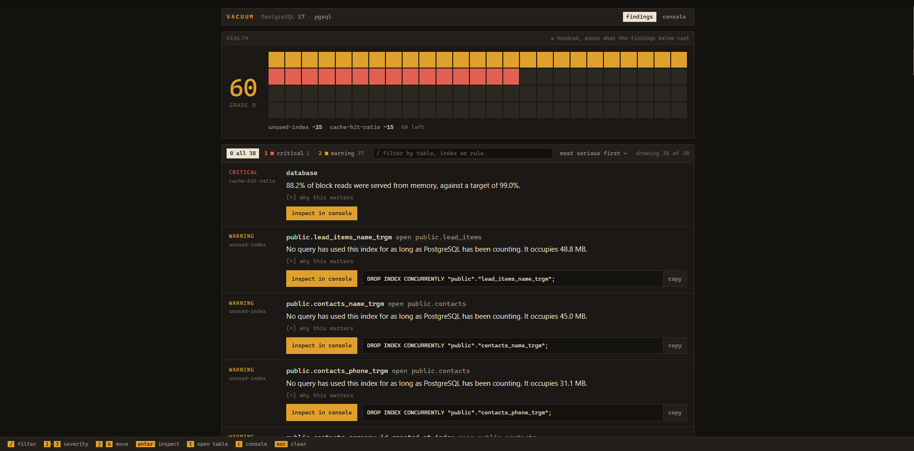
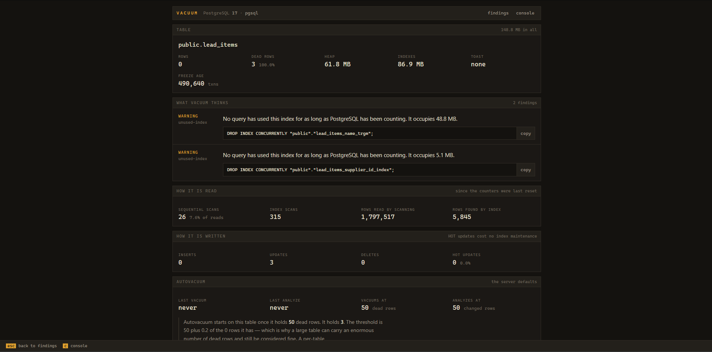
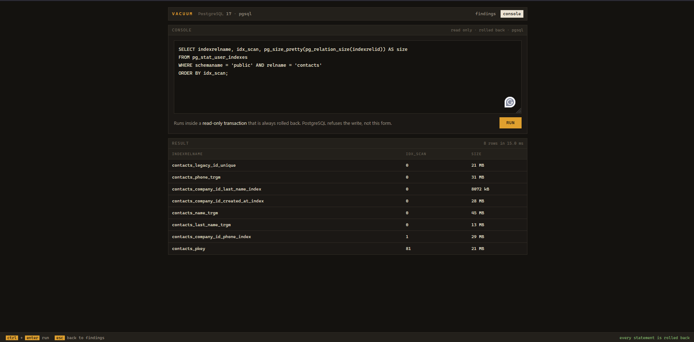
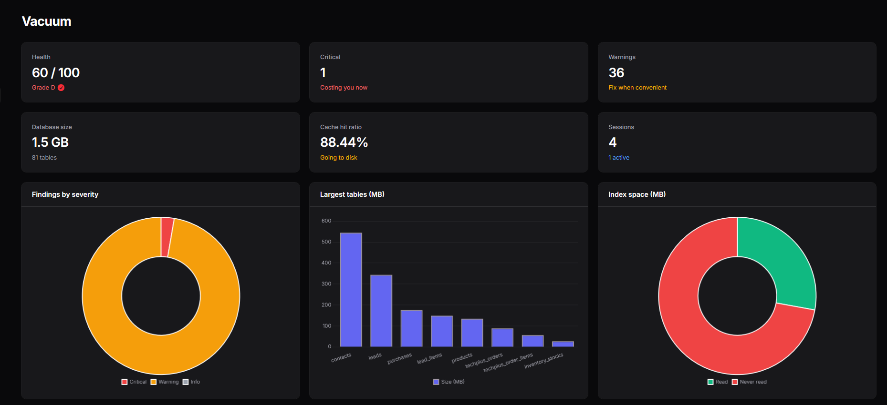
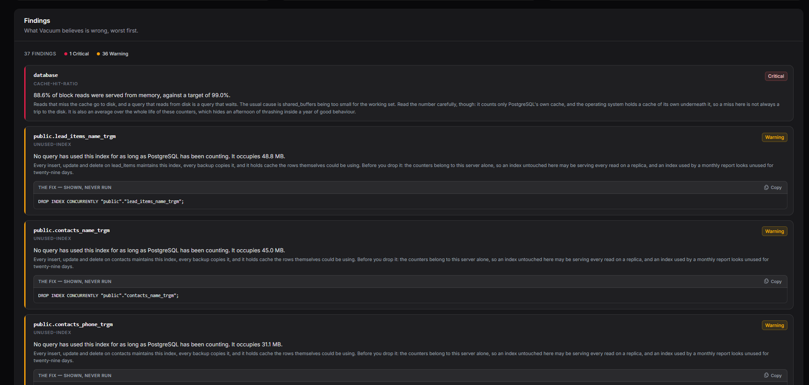
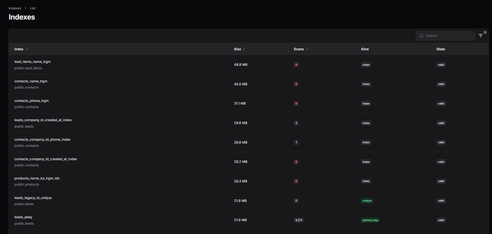
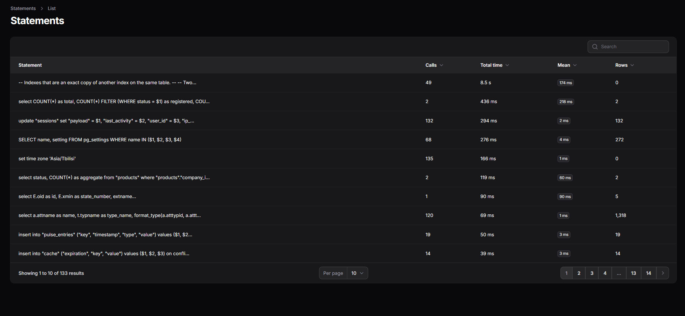
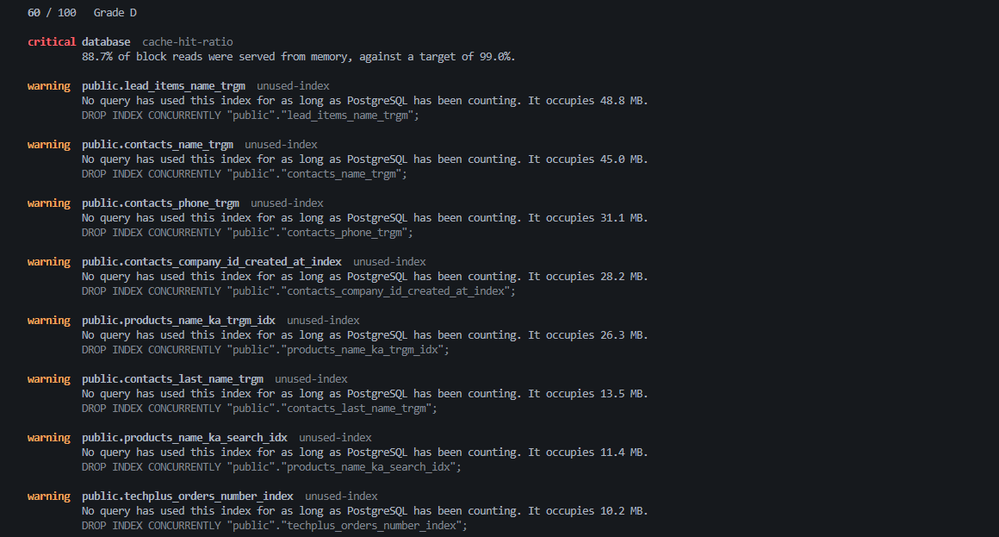

# Vacuum

[](https://packagist.org/packages/heyosseus/vacuum)
[](https://packagist.org/packages/heyosseus/vacuum)
[](https://packagist.org/packages/heyosseus/vacuum)

**A PostgreSQL monitoring and tuning dashboard for Laravel.**

Vacuum reads what PostgreSQL already knows about itself — `pg_stat_user_tables`, `pg_stat_user_indexes`, `pg_stat_activity`, `pg_stat_database`, `pg_stat_statements`, `pg_class` — and turns it into a page that says what is wrong, what it is costing you, and the statement that would put it right.

It shows you that statement. It never runs it.



> **Status: 0.1.0** — an early release. The `0.x` line follows semantic versioning, which means the surface may still shift between minor versions.

## What it tells you

| Rule | Finds |
| --- | --- |
| `wraparound` | Tables nothing has frozen, on their way to shutting the database down |
| `autovacuum-disabled` | A server with autovacuum switched off and left off |
| `dead-tuples` | Tables carrying more deleted-but-unreclaimed rows than they should |
| `stale-statistics` | Tables the planner is reasoning about from numbers that are no longer true |
| `table-bloat` | Tables whose files are much larger than the rows inside them |
| `unused-index` | Large indexes no query has ever read |
| `duplicate-index` | Indexes that are an exact copy of another index on the same table |
| `invalid-index` | Indexes every write maintains and no query is allowed to use |
| `cache-hit-ratio` | A database going to disk more often than it should |
| `idle-in-transaction` | Transactions opened and then abandoned |
| `blocked-session` | Sessions stuck waiting on somebody else's lock |
| `slow-statement` | The shapes of query that cost the most per run |

Every finding carries a severity, what the problem costs you, and — where a single statement would fix it — the SQL to run. Findings roll up into a health score out of 100, which is computed *from the findings themselves*, so the grade can never disagree with the list beneath it.

Six of those rules describe a database that is slower than it could be. `wraparound` describes one that **stops**: PostgreSQL counts transactions in 32 bits, and a table nothing freezes drags the whole cluster toward the end of that count, at which point the server refuses every write until it is shut down and vacuumed in single-user mode. It gives no warning of its own, and it does not slow down first.

## Requirements

- PHP 8.3+
- Laravel 11 or 12
- PostgreSQL 14+
- Filament 4 or 5 — optional, only if you want the UI inside a panel

`pg_stat_statements` is optional. Without it, Vacuum says so on the page rather than quietly showing you an empty panel.

## Installation

```bash
composer require heyosseus/vacuum
php artisan vacuum:install
```

`vacuum:install` publishes the config and asks one question: serve the UI as the standalone Blade dashboard, or inside a Filament panel? Answer Blade (the default) and you are done — open `/vacuum`. Prefer to do it by hand? `php artisan vendor:publish --tag=vacuum-config` and open `/vacuum` is the whole of the Blade path.

### The standalone dashboard

Open any table to see its full profile — size, dead rows, freeze age, how it is read and written, and the findings against it — worst first, each with the statement that would fix it.



The built-in SQL console runs every statement inside a read-only transaction that is always rolled back.



## Inside Filament

If your app already runs a [Filament](https://filamentphp.com) v4 or v5 panel, Vacuum can live inside it rather than at a separate `/vacuum` URL — the same data the Filament way.

**Filament is an optional peer.** The package never requires `filament/filament`; the plugin's classes load only when your app already has it, so nothing changes for a Blade-only install.

```bash
composer require heyosseus/vacuum
php artisan vacuum:install --filament
```

On the Filament path the installer finds your panel provider (`app/Providers/Filament/*PanelProvider.php`) and registers the plugin on it for you. It edits that file by **parsing it, not matching text** — it locates the `return $panel …;` chain with PHP's own tokenizer, backs the file up, splices in the plugin, and runs `php -l` on the result; if anything looks wrong it restores the backup and prints the one line to add by hand instead. It will not silently edit a file it cannot parse, and in a non-interactive shell it prints rather than writes unless you pass `--force`.

The one line it adds:

```php
->plugin(\Heyosseus\Vacuum\Filament\VacuumPlugin::make())
```

Then set the UI mode so the standalone Blade routes stand down and the same data is not reachable by two different doors:

```env
VACUUM_UI=filament
```

Authorization is shared, not duplicated: the plugin's `canAccess()` calls the same [`Vacuum::auth()`](#who-may-look) callback the Blade dashboard uses. One gate governs both.

### What the panel gives you

Everything lands in one **Vacuum** navigation group:

- **Overview** — the health story at a glance: the score and its grade, database vitals (size, table count, cache-hit ratio, live sessions), and charts for findings by severity, the largest tables, and how much index space is read versus never touched. Beneath them, the findings themselves, worst first — each with the statement that would put it right, shown and copied with one click, never run — and a live view of any vacuums PostgreSQL is running at that moment.
- **History** — where the database has been and where it is heading: the health line over time, what is newly wrong, what has cleared, and what is forecast to cross critical. Appears only when history is switched on — see [History over time](#history-over-time).
- **Tables** — a read-only resource over `pg_stat_user_tables` with native Filament sort, search, filter and pagination, and a drill-down carrying the same profile and findings as the Blade table page.
- **Indexes**, **Sessions**, **Statements** — the same read-only treatment over `pg_stat_user_indexes`, `pg_stat_activity` (live, polling) and `pg_stat_statements`. The last hides itself where the extension is not installed.

Every surface asks that one `Vacuum::auth()` callback, and every one opts out of Filament's tenant scoping — the catalogs Vacuum reads belong to the server, not to any one tenant — so the panel is at home in a multi-tenant install rather than throwing on a relationship these read-only models have no reason to carry.





The read-only resources over `pg_stat_user_indexes` and `pg_stat_statements` come with native Filament sort, search, filter and pagination.





> **The SQL console stays on the Blade UI for now.** It is not yet a Filament page, and `VACUUM_UI=filament` stands the standalone routes down, so if you rely on the console keep the Blade UI until a later release brings it inside the panel.

Flags for scripted installs: `--blade` / `--filament` skip the prompt, `--panel=<name>` picks one panel out of several, `--force` applies the edit without confirming.

## Who may look

**Vacuum opens in `local` and refuses everywhere else.** A forgotten configuration should lock the door, not publish the shape of your database.

To let anyone else in, register a callback — typically in `AppServiceProvider::boot()`:

```php
use Heyosseus\Vacuum\Vacuum;

Vacuum::auth(fn (Request $request) => $request->user()?->isAdmin() === true);
```

This is a callback rather than a Laravel gate on purpose. A gate is skipped entirely for a guest unless its first parameter is nullable, so the `fn ($user) => …` everyone writes would silently deny a developer who is not logged in, on their own laptop, where the dashboard is most useful.

If you authorize on the user, keep session middleware in the stack, or `$request->user()` will be null:

```php
'middleware' => ['web', 'auth'],
```

Vacuum appends its own authorization middleware to whatever you list, so the dashboard cannot be exposed by emptying that array.

## Which database

By default Vacuum inspects your application's default connection, which must be PostgreSQL — it refuses anything else rather than reporting nonsense.

```env
VACUUM_CONNECTION=pgsql_readonly
```

Point that at a role granted `pg_monitor` and nothing else. Vacuum never needs write access, and giving it none is the cheapest safety net you will ever configure.

## In your pipeline

The dashboard only tells you something if somebody opens it. The same rules run from a terminal:

```bash
php artisan vacuum:check
```

It exits **non-zero when the advisor finds something critical**, so a migration that ships a duplicate index fails the build, and a staging database drifting toward wraparound fails the nightly job, whether or not anybody was looking.



```bash
php artisan vacuum:check --fail-on=warning   # critical, warning, info, or never
php artisan vacuum:check --format=json       # score, grade, deductions, findings
```

Two things worth knowing. It **never writes** — the remediation is printed for you to read and decide on, exactly as it is on the page. And if Vacuum is disabled it **fails rather than passing**: a check that goes green because it never looked is worse than no check at all.

## History over time

Vacuum is point-in-time by default: every page and every `vacuum:check` reads the database as it is this instant. Switch history on and it records a snapshot on a schedule, so it can tell you which way a number is *moving* — bloat that is growing, a freeze age that climbs and never resets, a cache-hit ratio measured over the last hour rather than over the life of the server.

```env
VACUUM_HISTORY_ENABLED=true
```

```bash
php artisan vendor:publish --tag=vacuum-migrations
php artisan migrate
```

Then take a snapshot on a schedule — hourly is a sensible default:

```php
use Illuminate\Support\Facades\Schedule;

Schedule::command('vacuum:snapshot')->hourly();
```

Or let Vacuum register that for you: leave `VACUUM_HISTORY_SCHEDULE` at its default and it schedules the command itself. Set it to `null` when you would rather wire it up by hand.

**This is the package's only write path, and it never touches the database it inspects.** Snapshots are written with ordinary Eloquent to your application's own database — the published migration's tables live there — while the inspected server is still only ever read, read-only, through the same rolled-back transaction everything else uses. Point `VACUUM_HISTORY_CONNECTION` at a different connection to keep the history somewhere else again.

Once two snapshots exist, four things a single reading cannot say become available:

- **Interval-accurate numbers.** `cache-hit-ratio` and `slow-statement` are lifetime averages until history can difference two snapshots; then they report what the database actually did *over the last interval*. That is also what quietly clears the false alarm a one-off `VACUUM FULL` leaves behind in the slow-statement list.
- **Direction.** Each finding is marked climbing, easing or new, so a bloat figure inside its threshold but rising reads differently from the same figure holding steady.
- **A forecast.** For the numbers that only climb — freeze age, table size — Vacuum fits the recent trend and projects when it will cross the line that makes it critical: *wraparound-critical in about nine days at the current rate*. It stays silent unless it has enough snapshots and the points genuinely sit on a line; a guess wearing the clothes of a measurement is worse than nothing.
- **What changed.** The findings that are new since the previous snapshot, and the ones that have cleared.

Inside Filament this is a **History** page in the Vacuum group; on the Blade dashboard it is a **history** tab. Both appear only while history is on. Snapshots older than `VACUUM_HISTORY_RETENTION_DAYS` (90 by default) are pruned as each new one is taken.

## The SQL console

Off by default. Off means the route does not exist — not a page that says no.

```env
VACUUM_CONSOLE_ENABLED=true
```

Statements run inside a transaction PostgreSQL has been told is `READ ONLY`, with a `statement_timeout`, and the transaction is always rolled back.

**The keyword check is not what makes this safe.** Vacuum turns away statements that do not begin with a word that reads, but that is a courtesy for people who type `DELETE` by accident. It is not a defence, and it cannot be one:

```sql
WITH written AS (INSERT INTO orders (id) VALUES (1) RETURNING *) SELECT * FROM written
```

That begins with `WITH`, walks straight past any keyword filter, and writes to your database. What stops it is PostgreSQL, which refuses the write inside a read-only transaction. There is a test that smuggles exactly that statement through and then asserts the table is still empty.

`EXPLAIN ANALYZE` really runs the query it explains, so it needs its own switch:

```env
VACUUM_CONSOLE_EXPLAIN_ANALYZE=true
```

### A word on Laravel and read-only transactions

This is worth writing down, because it is not obvious and it silently defeats the naive implementation.

Laravel's `LostConnectionDetector` treats PostgreSQL's `SQLSTATE[25006]` — *cannot execute INSERT in a read-only transaction* — as a **lost connection**. If your read-only transaction is one Laravel does not know about (a raw `BEGIN TRANSACTION READ ONLY`), then `Connection::run()` catches the rejection, decides the connection died, reconnects, and **retries the statement on a fresh connection outside the transaction** — committing the very write PostgreSQL just refused.

Vacuum opens the transaction through Laravel's own `beginTransaction()` and then issues `SET TRANSACTION READ ONLY`. With `transactions >= 1`, Laravel rethrows instead of retrying. That is the entire reason the safety claim above is true rather than merely asserted, and it is covered by a test named `it does not let a rejected write be retried onto a fresh connection`.

## Tuning the thresholds

Every rule reads its limits from `config/vacuum.php`. The defaults are set for a database somebody depends on, not for a table you made a minute ago:

```php
'thresholds' => [
    'dead_tuple_ratio' => 0.20,
    'dead_tuple_minimum' => 1_000,
    'cache_hit_ratio' => 0.99,
    'cache_hit_minimum_blocks' => 100_000,
    'wraparound_xid_age' => 200_000_000,          // match your autovacuum_freeze_max_age
    'wraparound_xid_age_critical' => 1_000_000_000,
    'stale_statistics_ratio' => 0.20,             // autoanalyze fires at 0.10
    'stale_statistics_minimum' => 10_000,
    'stale_statistics_minimum_rows' => 1_000,
    'bloat_bytes' => 100 * 1024 * 1024,
    'unused_index_min_size' => 1024 * 1024,
    'long_running_query_seconds' => 60,
    'idle_in_transaction_seconds' => 300,
    'slow_query_milliseconds' => 500,
],
```

## Writing your own rule

A rule is handed one value object and returns a finding or nothing. It never touches the database, so it tests without one:

```php
use Heyosseus\Vacuum\Advisor\{Finding, Severity, TableRule};
use Heyosseus\Vacuum\Values\TableStatistic;

final readonly class NeverAnalyzed implements TableRule
{
    public function inspect(TableStatistic $table): ?Finding
    {
        if ($table->lastAnalyzedAt() !== null) {
            return null;
        }

        return new Finding(
            rule: 'never-analyzed',
            subject: $table->qualifiedName(),
            severity: Severity::Warning,
            summary: 'Nothing has ever analyzed this table, so the planner is guessing.',
            impact: 'Without statistics the planner cannot estimate row counts, and it will choose a bad plan confidently.',
            remediation: "ANALYZE {$table->qualifiedName()};",
        );
    }
}
```

Tag it, and the advisor picks it up:

```php
use Heyosseus\Vacuum\VacuumServiceProvider;

$this->app->tag([NeverAnalyzed::class], VacuumServiceProvider::TABLE_RULES);
```

There is a tag per subject — `TABLE_RULES`, `BLOAT_RULES`, `INDEX_RULES`, `DUPLICATE_RULES`, `CACHE_RULES`, `SESSION_RULES`, `STATEMENT_RULES`, `SETTING_RULES` — because a rule should be given the one thing it reasons about, and adding a rule should never widen what has to be queried before it can run.

## Restyling the dashboard

```bash
php artisan vendor:publish --tag=vacuum-views
```

The stylesheet is inlined rather than fetched from a CDN, on the grounds that the dashboard is what you open when the database is unwell, sometimes from a machine that cannot reach the internet.

## Development

Vacuum tests against a real PostgreSQL server. The statistics views it reads are the whole product, and SQLite cannot pretend to have them.

```bash
composer install
cp phpunit.xml.dist phpunit.xml     # then put your database credentials in it
composer test
```

`phpunit.xml` is gitignored, which is where your credentials should live.

`composer test` runs Rector, Pint, PHPStan at `level: max`, 100% type coverage and 100% line coverage. All of them have to pass.

For the `pg_stat_statements` tests, the extension must exist. It needs the library preloaded, which is read at startup:

```sql
ALTER SYSTEM SET shared_preload_libraries = 'pg_stat_statements';  -- then restart the server
CREATE EXTENSION pg_stat_statements;
```

Those tests skip themselves if it is missing, though the coverage gate will then fail.

## License

MIT. See [LICENSE.md](LICENSE.md).
